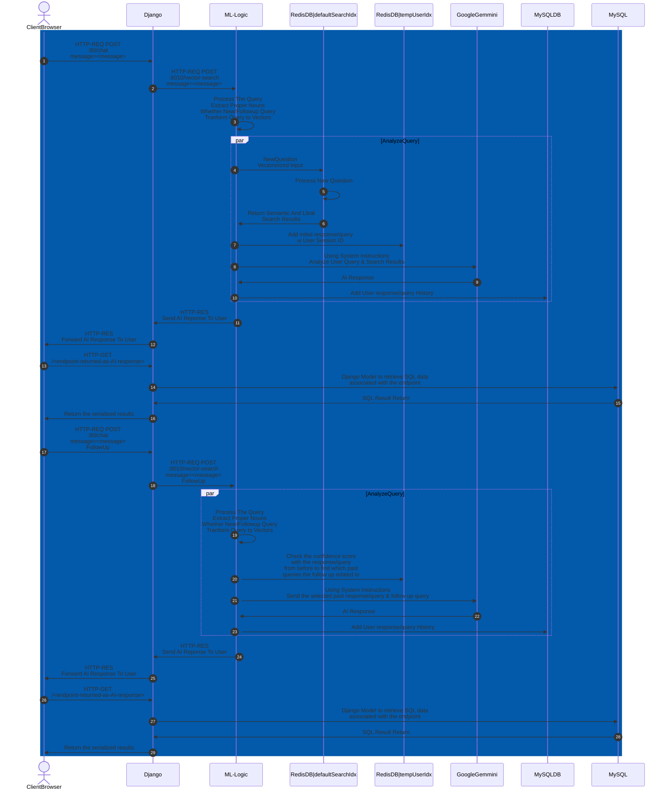

```mermaid
sequenceDiagram
    rect rgb(3, 89, 170)
    autonumber
    actor ClientBrowser
        ClientBrowser->>Django: HTTP-REQ POST<br/>:80/chat<br/>message=<message>
        Django->>ML-Logic: HTTP-REQ POST<br/>:8010/vector-search<br/>message=<message>
        activate ML-Logic
        ML-Logic->>ML-Logic: Process The Query<br/>Extract Proper Nouns<br/>Whether New/Followup Query<br/>Tranform Query to Vectors
        par AnalyzeQuery
            ML-Logic->>RedisDB|defaultSearchIdx: NewQuestion<br/>Vectororized Input
            RedisDB|defaultSearchIdx->>RedisDB|defaultSearchIdx: Process New Question<br/>
            RedisDB|defaultSearchIdx->>ML-Logic: Return Semantic And Litral<br/>Search Results
            ML-Logic->>RedisDB|tempUserIdx: Add initial response/query <br/>w User Session ID
            ML-Logic->>GoogleGemmini: Using System Instructions<br/>Analyze User Query & Search Results
            GoogleGemmini->>ML-Logic: AI Response
            ML-Logic->>MySQLDB: Add User response/query History
        end
        ML-Logic->>Django: HTTP-RES<br/>Send AI Reponse To User
        Django->>ClientBrowser: HTTP-RES<br/>Forward AI Response To User
        ClientBrowser->>Django: HTTP-GET<br/>/<endpoint-returned-as-AI-response>
        Django->>MySQL: Django Model to retrieve SQL data<br/>associated with the endpoint
        MySQL->>Django: SQL Result Return
        Django->>ClientBrowser: Return the serialized results
    %% Follow Up Question
        ClientBrowser->>Django: HTTP-REQ POST<br/>:80/chat<br/>message=<message><br/>FollowUp
        Django->>ML-Logic: HTTP-REQ POST<br/>:8010/vector-search<br/>message=<message><br/>FollowUp
        activate ML-Logic
        par AnalyzeQuery
            ML-Logic->>ML-Logic: Process The Query<br/>Extract Proper Nouns<br/>Whether New/Followup Query<br/>Tranform Query to Vectors
            ML-Logic->>RedisDB|tempUserIdx: Check the confidence score<br/>with the response/query<br/>from before to find which past<br/>queries the follow up related to
            ML-Logic->>GoogleGemmini: Using System Instructions<br/>Send the selected past response/query & follow up query
            GoogleGemmini->>ML-Logic: AI Response
            ML-Logic->>MySQLDB: Add User response/query History
        end
        ML-Logic->>Django: HTTP-RES<br/>Send AI Reponse To User
        Django->>ClientBrowser: HTTP-RES<br/>Forward AI Response To User
        ClientBrowser->>Django: HTTP-GET<br/>/<endpoint-returned-as-AI-response>
        Django->>MySQL: Django Model to retrieve SQL data<br/>associated with the endpoint
        MySQL->>Django: SQL Result Return
        Django->>ClientBrowser: Return the serialized results
    end
```